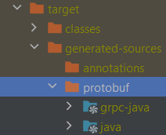
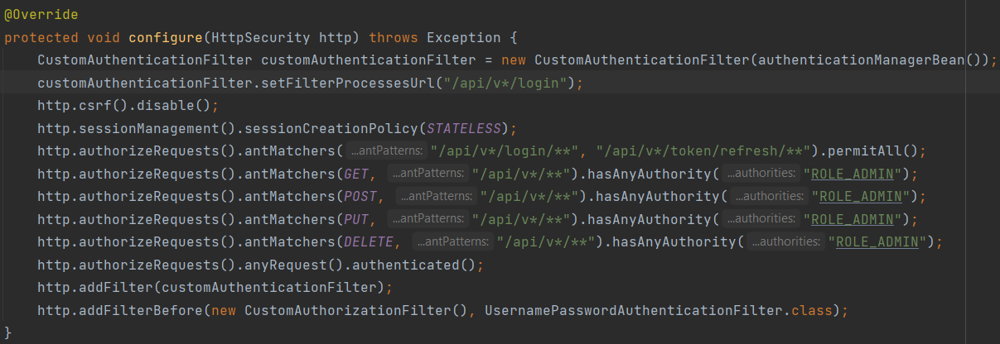
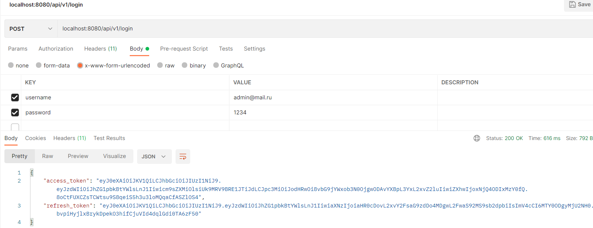
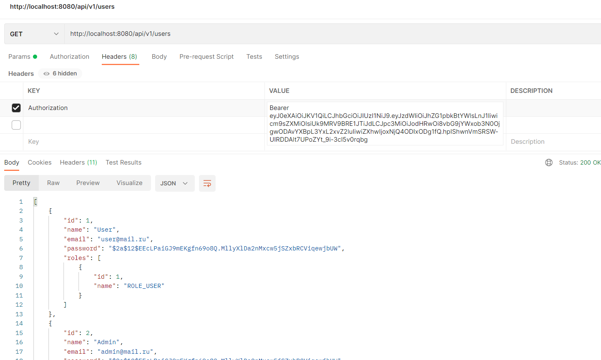
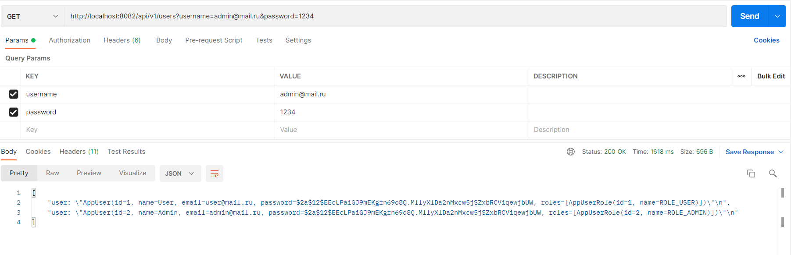

# Registaration User Service.
RESTful service 
* registration
* authentication and authorization with JWT acsess and refresh tokens.
* get information about users and their roles. 

Technologies
* Spring Boot
* Spring Security
* JWT
* PostgreSQL
* Flyway

Требования
* База данных userservice. username=postgres, password=psql, port=5432
* При первом запуске приложения, нужно сгенерировать классы для Grpc, выполнив maven package.После нужно проверить сгенерированные исходные файлы в указонной          директории. Если Idea не пометила их соответственно, нужно сделать это вручную. Mark Directory as -> Generated Sources Root(это же нужно сделать при первом запуске Grpc клиента)

 

Описание
* Сервис управления пользователями работатет на 8080 порту
* GRPC сервер работает на 8081 порту
* GRPC клиент работает на 8082 порту https://github.com/lParzivall/GrpcClient
* По умолчанию созданы два пользователя: user и admin с соответствующими ролями
* Организован доступ к API в зависимоти от роли пользователя

Пример работы приложения.

Аунтефикация

Авторизация(используется полученный access token)

Запрос сервиса GrpcClient от пользователя с правами ROLE_ADMIN

